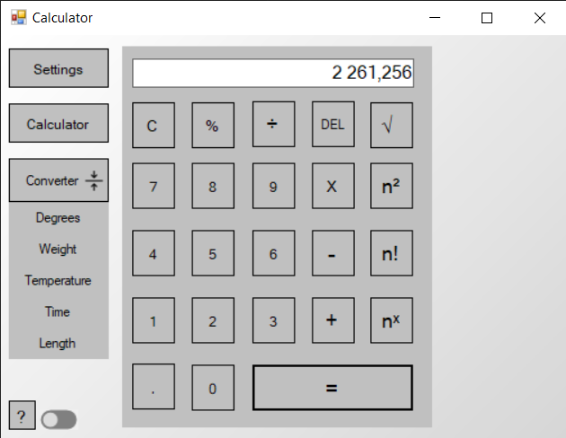
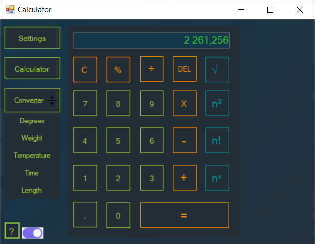

# Calculator - ivs_project02

## Prostředí
> Podporované operační systémy

Windows 64bit

## Aplikace

### LightMode

### DarkMode

## Autoři
### Tým: 5663 037108
| xlogin | Meno | Pracoval na |
| --- | --- | --- |
| xbockaa00 | Andrej Bočkaj | Trello, Github, Testovanie, Install/Uninstall tool, Kontrola funkcnosti |
| xfiloja00 | Jakub Fiľo | Vzhlad, Ovladacie prvky, Povinne/Nepovinne funkcie | 
| xtokusr00 | Richard Tokušev | Dokumentacia, Trieda premeny jednotiek |

## Licence
Tento program je poskytován [GNU](https://www.gnu.org/licenses/)

